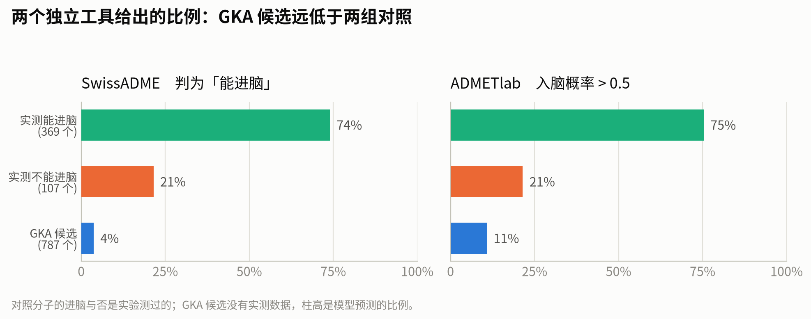
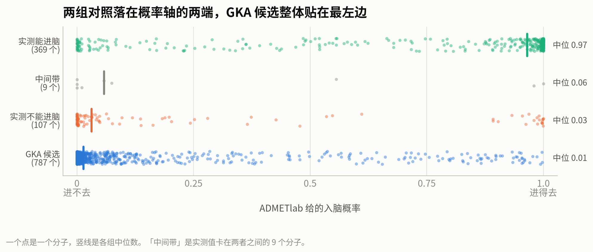
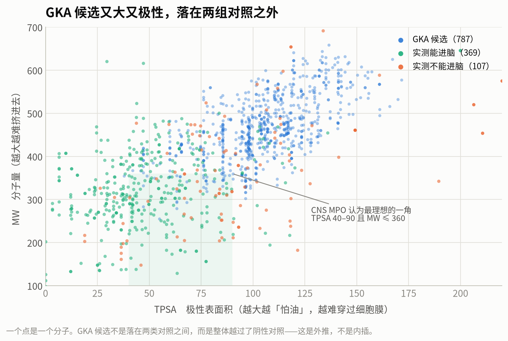
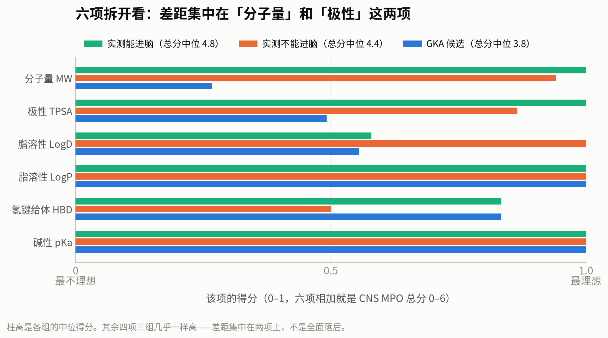

# 四张图：入脑对照 vs GKA 候选

数据来源：`Step3_04_Integrated_Brain_Penetration_Results.csv`（1,274 × 261）
作图脚本：`Step3_05_Make_Figures.py`
生成日期：2026-08-03

> **⚠ 这四张图是描述，不是判定。**
> 图里没有一条阈值线、没有"合格/不合格"的标注。
> 「流程算不算合格」「哪些 GKA 值得往下推」属 Step3_05 的讨论，本文不下这两个结论。

**四张图统一的分组**（和实验实测挂钩，不是模型说了算）：

| 组 | n | 怎么来的 |
|---|---:|---|
| 实测能进脑 | 369 | B3DB `control_positive` ∪ Fridén `Kp,uu ≥ 0.3` |
| 实测不能进脑 | 107 | B3DB `control_negative` ∪ Fridén `Kp,uu ≤ 0.05` |
| 中间带 | 9 | Fridén `0.05 < Kp,uu < 0.3`（只在图 2 出现，灰色） |
| GKA 候选 | 787 | 全部 |

另有 1 个对照（`FRI_0042` 头孢噻肟）实测值缺失，不进任何一组，也没被悄悄塞进哪一边。

---

## 图 1 —— 两个独立工具给出的比例



**一句话**：两个原理完全不同的工具，对三组给出的比例排序一致，
且 GKA 候选都远低于两组对照。

| | SwissADME 判「能进脑」 | ADMETlab 概率 > 0.5 |
|---|---:|---:|
| 实测能进脑（369） | 74% | 75% |
| 实测不能进脑（107） | 21% | 21% |
| **GKA 候选（787）** | **4%** | **11%** |

怎么读：

* 左右两块是**两个独立工具**——SwissADME 是画在 (TPSA, LogP) 平面上的一条几何边界，
  ADMETlab 是机器学习模型。两者的训练/构建数据、输出形式都不一样。
* **对照组的两个数字几乎完全重合**（74/75、21/21），这是巧合般的一致，
  但也说明两个工具在这批对照上给出的图景相同。
* GKA 候选两边都低，但**不一样低**（4% vs 11%）——
  说明"工具之间是否一致"这件事，在候选身上比在对照身上更需要小心。

⚠ 一个必须说清楚的不对称：**对照分子的进脑与否是实验测过的，GKA 候选没有任何实测数据**。
柱子高度对对照来说是"模型答对了多少"，对 GKA 候选来说只是"模型预测的比例"。

---

## 图 2 —— 每个分子一个点



**一句话**：两组对照被推到概率轴的两端，中间带落在中间，GKA 候选整体贴在最左边。

怎么读：

* 横轴是 ADMETlab 给的入脑概率，**0 = 进不去，1 = 进得去**；一个点是一个分子。
* 竖线是各组的中位数：实测能进脑 **0.97**，中间带 **0.06**，实测不能进脑 **0.03**，
  GKA 候选 **0.01**。
* **点是散开的，不是聚成一团**——每组都有跑到对面去的分子。
  比如"实测不能进脑"那一行右端有十几个点接近 1.0，这些是模型判错的（或者说，
  模型和实验的口径不同）。这类分歧是真实存在的，图上没有藏起来。
* GKA 候选那一行：绝大多数挤在最左端，但右侧确实散着几十个点——
  **那些点就是后面要挑出来看的分子**。

⚠ 这张图**只画了 ADMETlab**。原因是它给的是连续概率，能画成分布；
SwissADME 只给 Yes/No，画成点图没有信息量（全在 0 和 1 两个位置）。

---

## 图 3 —— 为什么会这样



**一句话**：GKA 候选又大又极性，**不是落在两组对照之间，而是整体越过了阴性对照**。

| | MW 中位 | TPSA 中位 |
|---|---:|---:|
| 实测能进脑 | 319 | 44 |
| **实测不能进脑** | **366** | **89** |
| **GKA 候选** | **463** | **105** |

怎么读：

* 横轴 TPSA（极性表面积，越大越亲水、越难穿过细胞膜），纵轴 MW（分子量，越大越难挤进去）。
  **两个轴都是"越小越容易进脑"**，所以理想区在左下角。
* 淡绿色方块是 CNS MPO 认为最理想的一角（TPSA 40–90 且 MW ≤ 360）。
* 绿点（能进脑）集中在左下，橙点（不能进脑）稍微往右上，
  **蓝点（GKA 候选）整片压在更右上**。

**这张图是前两张图的解释**：GKA 候选的预测值低，不是模型有偏见，
而是这批分子的基本性质本来就在 CNS 药物的常见范围之外——
它们当年是冲**肝和胰腺**设计的，本来也没打算进脑。

⚠ 但这张图同时暴露了一个**方法学问题**，是 Step3_05 必须面对的：
模型/规则都是从对照那片区域总结出来的，
**GKA 候选站在对照集之外，对它们的预测属于外推，不是内插**。
"工具在对照集上分得开"和"工具在 GKA 上同样可靠"是两件事。

---

## 图 4 —— CNS MPO 六项拆开



**一句话**：GKA 候选的 CNS MPO 总分低（中位 3.8 vs 对照 4.8），
但拆开看，差距**只集中在分子量和极性两项**，其余四项和对照几乎一样。

各组六项的中位得分（每项 0–1，六项相加 = 总分 0–6）：

| 项 | 实测能进脑 | 实测不能进脑 | GKA 候选 |
|---|---:|---:|---:|
| 分子量 MW | 1.00 | 0.93 | **0.27** |
| 极性 TPSA | 1.00 | 0.81 | **0.49** |
| 脂溶性 LogD | 0.58 | 1.00 | 0.55 |
| 脂溶性 LogP | 1.00 | 1.00 | 1.00 |
| 氢键给体 HBD | 0.77 | 0.50 | 0.83 |
| 碱性 pKa | 1.00 | 1.00 | 1.00 |
| **总分中位** | **4.8** | **4.4** | **3.8** |

怎么读：

* GKA 候选在 **HBD 一项上比两组对照都好**（0.83），LogP 满分，pKa 满分。
  所以"这批分子性质差"是不准确的说法——**它们只在两项上偏**。
* 这对**改造**是有意义的信息：如果要往入脑方向改，
  要动的是分子量和极性，而不是全面推翻。
* ⚠ **注意最后一行：实测能进脑 4.8、实测不能进脑 4.4——CNS MPO 几乎分不开这两组对照。**
  这不是实现错误（六条曲线已用原文算例逐项验证过），
  而是 CNS MPO 原文自己说过的话：
  > "the algorithm is **not intended to be used purely as a predictor of CNS penetration**"

  它衡量的是"性质像不像一个 CNS 药"，不是"能不能进脑"。
  **Step3_05 若要用 CNS MPO，必须先面对它在本项目对照集上分辨力有限这个事实。**

---

## 图里右侧那些蓝点是谁

图 2 和图 3 都能看到 GKA 候选里有少数分子跑到了"好"的一侧。把它们点名：

**两个工具都判能进脑的，只有 3 个**（787 个里）：

| mol_id | ChEMBL | ADMETlab 概率 | CNS MPO | MW | TPSA | SwissADME P-gp 底物 | 效力档 |
|---|---|---:|---:|---:|---:|---|---|
| `GKA_0492` | `CHEMBL3358425` | 0.54 | 4.84 | 328 | 76 | **No** | P4（pAct 6.92） |
| `GKA_0718` | `CHEMBL3764328` | 0.58 | 4.14 | 355 | 49 | Yes | P4（pAct 6.20） |
| `GKA_0639` | `CHEMBL3764930` | 0.56 | 3.95 | 355 | 38 | Yes | P4（pAct 6.47） |

后两个是同一个骨架的近亲，且都被 SwissADME 判为 **P-gp 底物**——
按项目里"必须 BBB+ 且非 P-gp 底物"的口径，**只剩 `GKA_0492` 一个**。

**落在图 3 那个淡绿色方块附近（MW ≤ 400 且 TPSA ≤ 90）的有 71 个**，
其中 ADMETlab 概率 > 0.5 的 16 个、CNS MPO ≥ 4 的 64 个。
概率最高且非 P-gp 底物的几个：

| mol_id | ChEMBL | ADMETlab | CNS MPO | MW | TPSA | 效力档 | 骨架簇大小 |
|---|---|---:|---:|---:|---:|---|---:|
| `GKA_0061` | `CHEMBL3358432` | 0.96 | 4.42 | 368 | 76 | **P2（pAct 7.85）** | 1（独苗） |
| `GKA_0570` | `CHEMBL1257742` | 0.95 | 3.82 | 367 | 42 | P4（6.67） | 8 |
| `GKA_0756` | `CHEMBL474354` | 0.94 | 3.89 | 343 | 77 | P4（6.09） | 26 |
| `GKA_0698` | `CHEMBL2430852` | 0.80 | 4.04 | 390 | 47 | P4（6.25） | 5 |
| `GKA_0631` | `CHEMBL573751` | 0.71 | 4.28 | 352 | 60 | P4（6.50） | 3 |
| `GKA_0251` | `CHEMBL451084` | 0.70 | 4.94 | 293 | 68 | P3（6.43） | 1（独苗） |

⚠ **这不是 Step3_05 的候选名单**，理由有三条，每条都能推翻上表：

1. **阈值没有标定过。** `0.5`、`≥4` 都是文献里的习惯值，**还没在本项目的对照集上验过**。
   按项目方法论，阈值必须用对照标定，不能拿来就用——这正是 Step3_05 的第一项工作。
2. **这些分子处在外推区**（见图 3），预测本身的可信度未经评估。
3. **入脑只是一个维度。** 上表里效力最好的是 `GKA_0061`（P2），
   其余多是 P4（效力 0.32–1 µM 档）。真要往下推，效力、选择性、骨架多样性都要一起看。

---

## 复现

```bash
/home/sgao30/micromamba/bin/micromamba run -n GKA_in_Brain python Step3_05_Make_Figures.py
```

配色取自 dataviz 规范的分类槽 1/2/3（blue `#2a78d6` / orange `#eb6834` / aqua `#1baf7a`），
该组合是文档中已验证 all-pairs 色觉友好的三色，脚本里未作任何改动。
